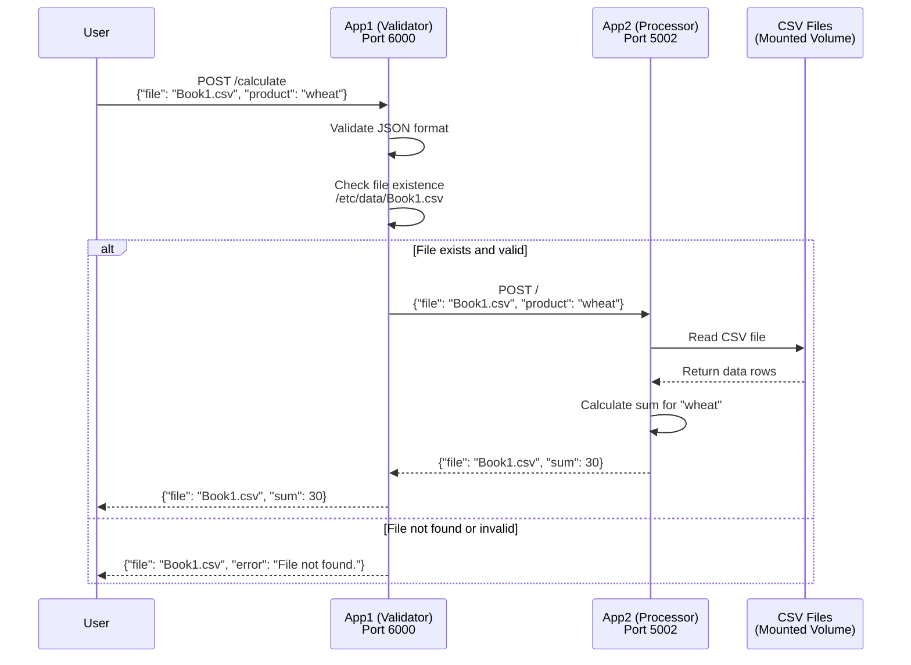

# Information Retrieval Application

A multi-container Docker application that processes CSV files to calculate product totals through a secure, validated API workflow.

## Overview

This application consists of two Flask microservices that work together to:
- Validate and sanitize user input
- Process CSV files to calculate product totals
- Provide secure API endpoints for data retrieval

## Architecture

### App1 (Input Validator) - Port 6000
- **Purpose**: Validates user input and file existence
- **Function**: Acts as a gateway, ensuring only valid requests reach the processing service
- **Validation**: Checks JSON format, file existence, and input sanitization

### App2 (Data Processor) - Port 5002
- **Purpose**: Processes CSV files and calculates product totals
- **Function**: Reads CSV data, sums amounts for specified products
- **Output**: Returns calculated totals or appropriate error messages

## Application Flow



## API Usage

### Endpoint: `POST /calculate`
```json
{
  "file": "Book1.csv",
  "product": "wheat"
}
```

### Response Examples
```json
// Success
{
  "file": "Book1.csv",
  "sum": 30
}

// Error
{
  "file": "Book1.csv",
  "error": "File not found."
}
```

## Quick Start

1. **Clone the repository**
   ```bash
   git clone <repository-url>
   cd Information-Retrieval-Application
   ```

2. **Run with Docker Compose**
   ```bash
   docker-compose up
   ```

3. **Test the API**
   ```bash
   curl -X POST http://localhost:6000/calculate \
     -H "Content-Type: application/json" \
     -d '{"file": "Book1.csv", "product": "wheat"}'
   ```

## Data Format

CSV files should contain:
- Header row: `product,amount`
- Data rows: product name and numeric amount

## Technical Stack

- **Containerization**: Docker, Docker Compose
- **Backend**: Python, Flask
- **Communication**: REST APIs, HTTP requests
- **Data Processing**: CSV parsing, JSON responses

## Security Features

- Input validation and sanitization
- File existence verification
- Error handling for malformed data
- Container isolation for enhanced security